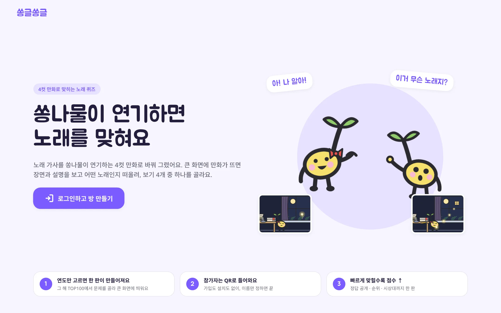
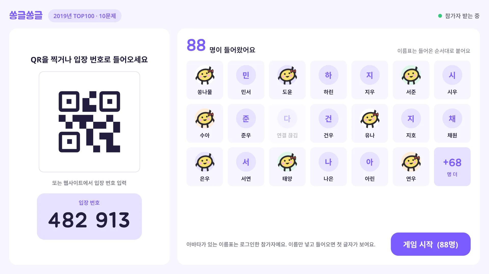
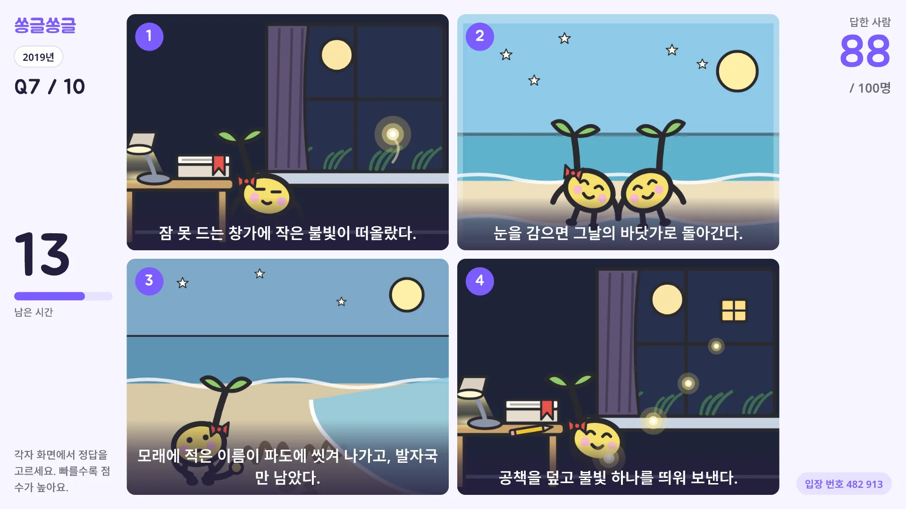
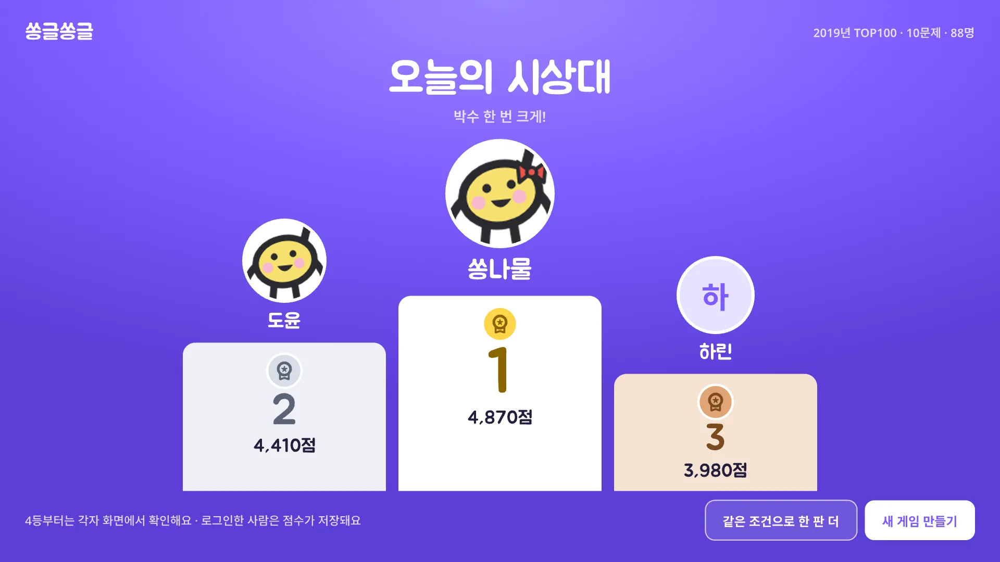
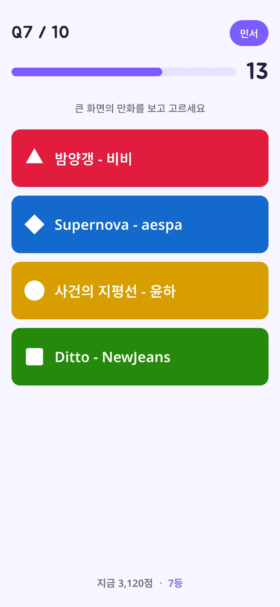
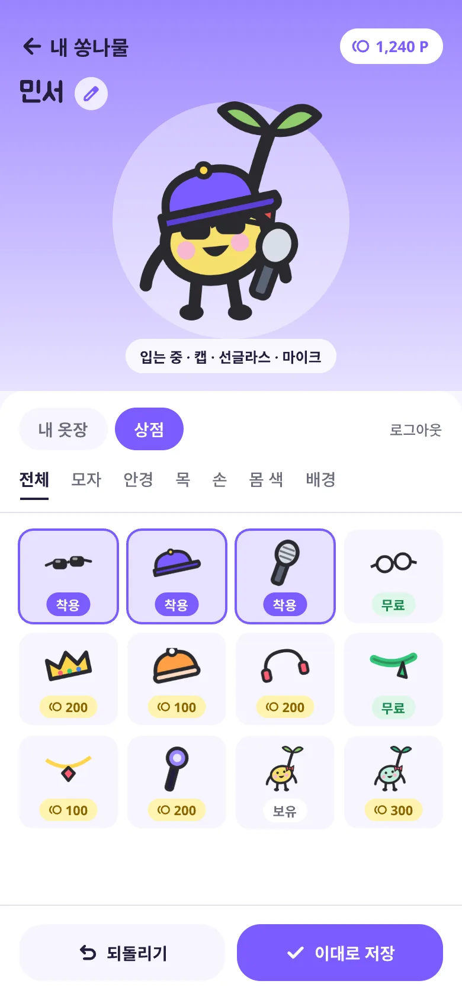
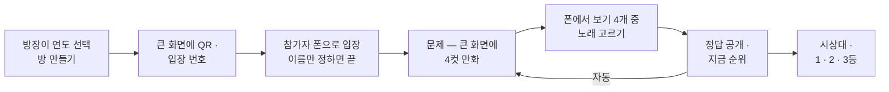
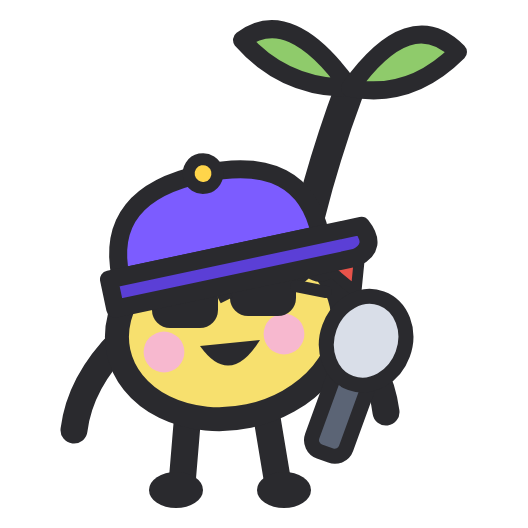

# 쏭글쏭글

**4컷 만화만 보고 노래를 맞혀요.**

마스코트 쏭나물이 노래 가사를 4컷 만화로 연기합니다. 큰 화면에 만화가 뜨면, 각자 폰에서 보기 4개 중 노래를 고릅니다.
제목도 가사도 없이 장면만 보고 떠올려야 해서, 아는 노래인데도 한 박자 늦게 "아!" 하게 됩니다.

 

| 구분 | 여느 노래 퀴즈 | 쏭글쏭글 |
|---|---|---|
| 문제 | 전주 듣기 · 가사 빈칸 | 쏭나물이 연기하는 **4컷 만화** — 제목도 가사도 없이 장면만 |
| 참가 | 앱 설치 · 가입 | **QR 찍고 이름만** — 가입도 설치도 없음 |
| 곡 고르기 | 진행자가 한 곡씩 | 연도 하나만 고르면 그 해 TOP100에서 알아서 출제 |
| 진행 | 진행자가 매번 넘김 | 정답 공개 뒤 **자동으로** 다음 문제 |
| 내 캐릭터 | 없음 | 로그인하면 **쏭나물을 꾸미고** 점수 · 포인트가 쌓임 |

**바로 보기** — [릴리즈](../../releases) · [변경 이력](./CHANGELOG.md)

---

## 화면

  
  
  

  
  
  

---

## 게임 방법

### 한 판의 흐름

### 방장 (PC + 큰 화면)

1. **로그인하고 방 만들기** — 구글 계정으로 로그인합니다.
2. **연도 카드 하나 누르기** — 2018 · 2019 · 2020 중 하나. 그 해 인기곡 TOP100에서 문제가 나옵니다.
   - 살짝 손보고 싶으면 같은 화면에서 난이도(섞어서 · 쉬움 · 보통 · 어려움), 문제 수(5 · 10 · 15 · 20), 장르(아이돌 · 보컬 · 밴드·인디 · 힙합·R&B)만 고르면 됩니다. 기본은 섞어서 10문제.
   - 연도를 안 가리고 싶으면 **랜덤으로 바로 시작**.
3. **대기실을 큰 화면에 띄우기** — TV나 빔프로젝터에 대기실을 띄우면 QR 코드와 입장 번호 6자리가 크게 뜹니다. 참가자가 들어올 때마다 이름표가 붙습니다.
4. **게임 시작** — 다 들어왔으면 시작을 누릅니다. 이후엔 정답이 공개되면 자동으로 다음 문제로 넘어가서 손댈 일이 없습니다.

### 참가자 (폰)

1. **QR 찍기** 또는 입장 번호 6자리 입력.
2. **이름 정하기** — 닉네임(1~12자)만 넣으면 바로 들어갑니다. 같은 이름은 쓸 수 없습니다.
   - 점수를 남기고 싶으면 **Google로 내 쏭나물로 들어가기**. 내가 꾸민 쏭나물로 참가하고 점수 · 포인트가 쌓입니다.
3. **답 고르기** — 큰 화면의 만화를 보고 폰에서 보기 4개(🔺 🔷 ⚪ 🟩) 중 하나를 고릅니다. 한 번 고르면 바꿀 수 없고, **빠를수록 점수가 높습니다.**
4. **정답 공개** — 맞았는지, 몇 점 얻었는지, 지금 몇 등인지 폰에 뜹니다. 큰 화면엔 보기별로 몇 명이 골랐는지와 TOP 5가 보입니다.
5. **시상대** — 마지막 문제가 끝나면 큰 화면에 1 · 2 · 3등이 오르고, 폰에는 내 최종 등수가 뜹니다.

### 점수

- 정답이면 점수를 얻고, **빨리 고를수록 더 많이** 얻습니다. 오답은 0점.
- 순위는 누적 점수 순. 정답 공개마다 지난 문제 대비 오르내림(▲▼)이 보입니다.
- 로그인한 참가자는 점수가 포인트로 쌓여 쏭나물 꾸미기에 씁니다.

### 만화는 어떻게 만들어지나요

- 노래 가사를 쏭나물이 연기하는 4컷 만화로 옮겨 그렸습니다. 노래 제목은 만화 어디에도 나오지 않습니다 — 장면과 짧은 설명이 힌트입니다.
- 주인공은 늘 쏭나물이고, 매 문제 4칸이 한 화면에 다 보입니다.

---

## 쏭나물 꾸미기

로그인한 사람은 마이페이지에서 내 쏭나물을 꾸밀 수 있습니다.

- **부위별 아이템** — 모자(캡 · 왕관 · 비니 · 헤드폰), 안경(선글라스 · 안경), 목(목도리 · 목걸이), 손(마이크 · 응원봉), 몸 색(기본 · 민트 · 포도 · 복숭아 · 하늘 · 레몬)
- 같은 부위는 하나만, 부위가 다르면 겹쳐 입습니다. 격자에서 누르면 바로 입고 벗고, **이대로 저장**하면 끝.
- 꾸민 모습은 대기실 이름표 · 순위표 · 시상대에 그대로 보입니다.
- 아이템은 무료 또는 포인트로 삽니다. 포인트는 게임 점수로 쌓입니다.

---

## 앱 다운로드

| 플랫폼 | 설치 |
|---|---|
| **웹** | 설치 없이 브라우저에서. 홈 화면에 추가하면 앱처럼 뜹니다 |
| **Android** | [릴리즈](../../releases/latest)에서 APK 내려받기 · Google Play |
| **iOS** | App Store · TestFlight |

- 방장은 PC 브라우저에서, 참가자는 폰에서 씁니다. 참가자는 앱이 없어도 QR만 찍으면 됩니다.
- 앱은 웹을 담는 하이브리드 형태라, 웹이 갱신되면 앱도 재설치 없이 함께 갱신됩니다.
- 내려받기 링크는 버전별 [릴리즈](../../releases)에 올라갑니다.

 
